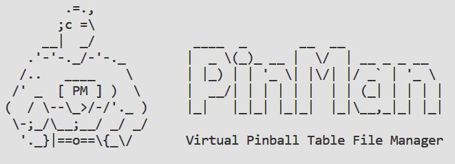

# PinMan

<figure><figcaption></figcaption></figure>

## Welcome to PinMan

Welcome to PinMan! Here you'll find all the documentation you need to get up and running with the PinMan software.

## What is PinMan?

PinMan lets you maintain your collection of pinball games separate from the software that runs them.

Virtual pinball software, as awesome as it is, is actually an assembly of multiple separate software projects cobbled together over many years. One flaw of this ad hoc architecture, in my opinion, is that your data files (pinball tables, table-specific configurations, media, etc.) reside in the same directories as the code that runs them. It is common practice to keep application software and user data separate for better organization and accessibility. _Imagine you had to keep all your Word docs in the same folder as the Microsoft Office installation files?_ PinMan is an attempt to solve this problem by letting you maintain a collection of pinball games separate from the software that runs them.

Using PinMan, you can more easily manage all your virtual pinball tables, maintain different versions, perform backups and restores, distribute games to multiple pinball cabinets and desktops), and more.

Currently, PinMan is run as a command-line interface (CLI) from a terminal window. A desktop graphical interface (GUI) is planned.

Learn more by reading about the general concepts and terminology of PinMan:


[core-concepts.md](core-concepts.md)


## Want to jump right in?

Feeling like an eager beaver? Jump in to the quick start docs and get making your first request:


[quick-start.md](quick-start.md)


## Want to deep dive?

Dive a little deeper and start exploring our API reference to get an idea of everything that's possible with the CLI:


[cli-reference](reference/cli-reference/)


## Want to solve a specific problem?&#x20;

Discover details of the various ways you can use PinMan to install, backup, manage, maintain or upgrade your games, organize your collections, and find troubleshooting tips in the User Guides.


[Broken link](broken-reference)

