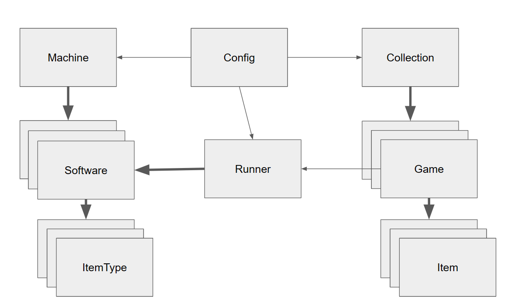

# Concepts

Virtual pinball software, as awesome as it is, is actually an assembly of multiple separate software projects cobbled together over many years. One flaw of this ad hoc architecture, in my opinion, is that your data files (pinball tables, table-specific configurations, media, etc.) reside in the same directories as the code that runs them. _Imagine you had to keep all your Word docs in the same folder as the Microsoft Office installation files?_ PinMan is an attempt to solve this problem by letting you maintain a collection of pinball games separate from the machine and software that runs them.

The following diagram illustrates the architecture of PinMan:

<figure><figcaption>
Architecture of the PinMan software
</figcaption></figure>

With PinMan, you have a Machine where your various virtual pinball Software is installed. And you have a Collection of Game folders, each containing the files and data (Items) for a specific version of a pinball table.&#x20;

As usual, to run and play a table all the Game files must be installed on the Machine, distributed into the specific Software directories and data stores as needed. But now, with PinMan, you can more easily automate this process. All the stuff associated with a specific table is kept in one place, its Game folder. Those can then be Installed onto the Machine Software with a single command.

Likewise you will continue to use the existing vpin tools to configure your setup, including screen layouts, PinUP media, game settings, and so on. Then, with PinMan you can use a single command to Collect all the files and settings that may have changed for a table back into the Collection Game folder.

