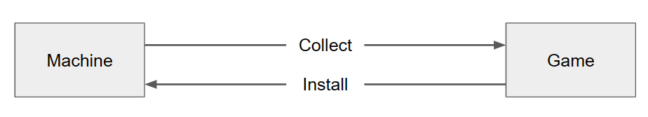

# Core Concepts

Virtual pinball software, as awesome as it is, is actually an assembly of multiple separate software projects cobbled together over many years. One flaw of this ad hoc architecture, in my opinion, is that your data files (pinball tables, table-specific configurations, media, etc.) reside in the same directories as the code that runs them. _Imagine you had to keep all your Word docs in the same folder as the Microsoft Office installation files?_ PinMan is an attempt to solve this problem by letting you maintain a collection of pinball games separate from the machine and software that runs them.

## Key Features: Collect and Install

With PinMan, you have a Machine where your various virtual pinball Software is installed. And you have a Collection of Games, organized as folders each containing the files and data for a specific version of a virtual pinball table.&#x20;

As usual, to run and play a pinball table, all the Game files must be installed on the Machine, distributed into the specific Software directories and data stores as needed. But now, with PinMan, you can more easily automate this process. A master copy of all the stuff associated with a specific table is kept in one place, its Game folder. You can then **Install** those onto a Machine with a single command.

Likewise, you will continue to use your existing virtual pinball software tools to setup and run your games, including screen layouts, PinUP media, game settings, and so on. Then, with PinMan you can use a single command to **Collect** everything that may have changed for a given table, saving it back into its Game folder.

<figure><figcaption>
PinMan Collect and Install Commands
</figcaption></figure>

Below is an example file folder structure of some game files installed on a machine, and the corresponding files collected into a game folder. (The file names and organization of the Game folder is configurable).

<figure><figcaption></figcaption></figure>

&#x20;

To learn more about the Collect and Install commands, and many other features, see the [User Guides](broken-reference) and the [CLI Reference](reference/cli-reference/) pages.

## Problems and Solutions

Some of the problems and complexity of virtual pinball systems that PinMan hopes to address include:

* SEPARATION OF USER DATA. It is common practice to keep application software and user data separate for better organization and accessibility. Virtual pinball generally violates this principle by requiring your game files live in the same directories as the installed software. With PinMan, your games are stored in folders separate from the virtual pinball software.
* MANY FILES PER GAME. In virtual pinball, there are many downloads and files per game table, with lots of variation in file types, names, purposes, packaging (e.g. zip. rar), and versions. Keeping track and managing all the files associated with a specific game is difficult. With PinMan, you can first add all the download files for a game to a single Game folder, and then install them to a Machine in one step.&#x20;
* MULTIPLE SOFTWARES. There are various pinball emulators, media players and other associated software, each with complex setups and unique folder structures that you need to remember and properly care for. With PinMan, your software setup is defined a Config file that knows all this, so you don't have to.&#x20;
* GAME INSTALLATION. Installing new games can be tedious and error prone. Yet the process is basically the same and repetitive for each game. PinMan knows which files go where, and new games can be installed with a single command. &#x20;
* GAME VARIATIONS. If you want to try different versions of a game, experiment with configurations, script changes, or try alternative media files, it is difficult to keep track of what-is-what and what-is-where. With PinMan you can have multiple variants of each table and choose to install or uninstall them as you wish.
* MULTIPLE MACHINES. Installing the same games to multiple machines requires setting up each individually. There is no way to ensure the machines are consistent in the files and configurations for each game. With PinMan, you can install a given Game to multiple machines.
* TROUBLESHOOTING. Existing virtual pinball setups tend to be "brittle", that is, subject to unexpected breakage and problems. PinMan lets you collect all the files and data for a given game into its own Game folder. That can help with troubleshooting by comparing changes in a game's configuration on a machine against a last known working version saved in its Game folder.
* SYSTEM RECOVERY. Rebuilding a virtual pinball machine after a disk crash or major upgrade requires having a full system backup, not all data may have been preserved (e.g Windows registry), and more likely requires hours of restoration work. Also, it is nearly impossible to partially restore some but not all games to a machine. Because PinMan maintains each game and all its data in its own folder, you can more methodically restore a system if necessary.

## Architecture

PinMan is designed to be extremely flexible and customizable for your specific configurations. Almost everything about the tool is data-driven, controlled through a configuration file that you can change to meet your needs and adapt to future changes to pinball software, machine setup, and new types of games you add to your machine.

The following diagram illustrates the organization of PinMan. (Thick arrows indicate one-to-many, thin arrows for one-to-one).&#x20;

<figure><figcaption>
Architecture of the PinMan software
</figcaption></figure>

The Config file (_pinman.config.yaml_) describes your setup, including the Machine(s) and Software you have. It also defines one or more Runners that lists the Software needed to run a Game.&#x20;

On the left is a virtual pinball Machine, which has multiple Software projects installed. Each Software manages multiple Item Types (e.g. files and data). For example, Visual Pinball software, may be installed at _C:\vPinball\VisualPinball_, has Item Types including a VPX file, and optionally a DirectB2S file and ROM .zip file.

On the right is a Collection of Games. Each Game folder contains the specific files and data Items for the game. For example, its Items may include the "Twilight Zone (Bally 1993).vpx" and "tz\_94ch.zip" ROM files. A Game also has a Manifest file that includes the name of the Runner it uses.&#x20;

Here are some definitions:&#x20;

* MACHINE - a virtual pinball system where you play your game tables. Can be a physical pinball cabinet, or a Windows desktop. Machines are identified by a unique name and a root folder or network identifier. A Machine is configured with a list of its installed software. PinMan allows you to manage more than one Machine for your Collection.
* SOFTWARE - references a software project used on a virtual pinball machine and required to play a pinball table. A machine will have multiple Software installed. We're only concerned with software that has table-specific data. Each Software is configured with a list of Item Types it manages.
* ITEM TYPE - a table-specific data item managed by Software on a Machine. There are many different kinds of Item Types, including files, INI data, XMLdata, Windows registry data, SQLite database records, whole directories and more. Parameters of each ItemType are defined in the Config file. For example, for a VisualPinball game, ther will be a .vpx file Item Type.
* CONFIG FILE - the config file defines the Machines, Runners, Software, and ItemTypes managed by PinMan, along with other settings. A default Config file (_pinman.config.yaml_) comes built-in to PinMan that covers many common virtual pinball installations, including that from BallerInstaller. As a YAML format text file, it is easily edited and updated to suit your needs.
* RUNNER - a list of Software names required by a game to run on a machine. For example, you may have a Runner named "VisualPinball" that includes Visual Pinball, PinUPSystem, and PinballY, and a separate Runner "FuturePinball" that include Future Pinball software instead.
* COLLECTION - a directory containing your Game folders.&#x20;
* GAME - a sub-directory under a Collection that contains the files and other data required to configure and play a game. Each Game folder must contain a Manifest file that identifies the Items present in the folder.
* ITEM - a piece of data required by virtual pinball Software for a specific table (correlated to a Software ItemType). For example, for the "Twilight Zone" VisualPinball game, there may be a  "Twilight Zone (Bally 1993).vpx" item. In addition to files, PinMan can also collect and install table-specific data extracted from, for example, DmdDevice.ini, B2STableSettings.xml, and PUPDatabase.db files. All of the data is saved in the Game's folder.&#x20;
* MANIFEST FILE - each Game folder has a Manifest file that defines properties of the game needed to Collect from and Install to a Machine. It is a YAML-format text file named game.manifest.yaml. The Manifest defines which Runner the game uses, the Base file name (e.g. "Twilight Zone (Bally 1993)"), and other files and data Items that are part of the game (e.g the ROM name " tz\_94ch"). PinMan provides tools to help automate building and updating the Manifest file, although it can also be edited directly with a text editor.&#x20;

This architecture help make PinMan extremely flexible and adaptable for managing your virtual pinball data.&#x20;
